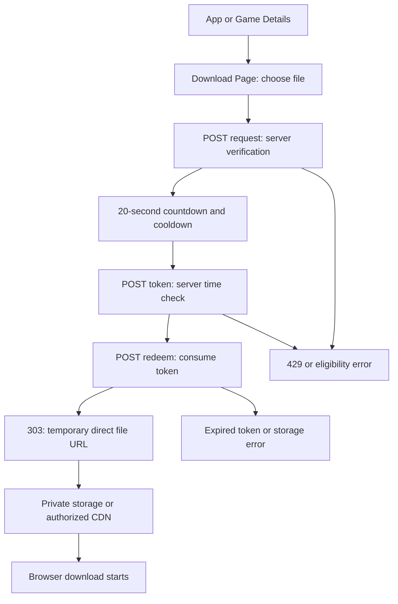
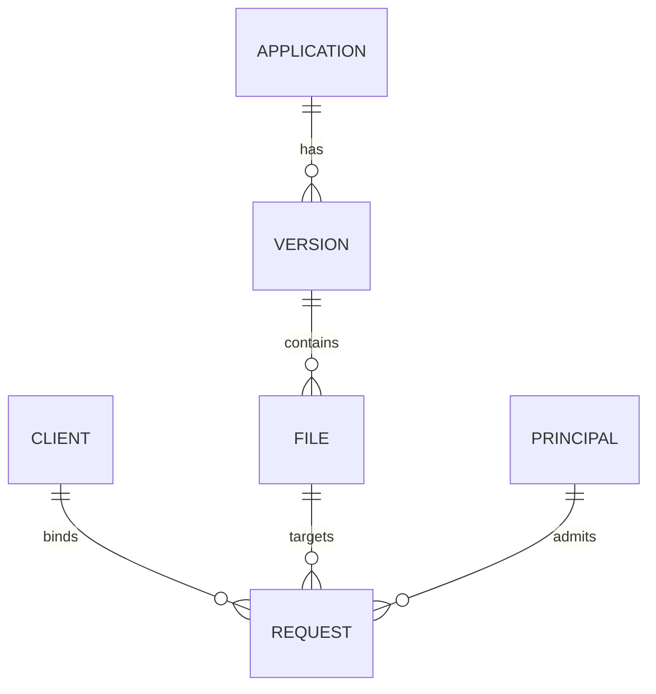

# Phase 3: Direct Download System Specification

**Status:** implementation-ready design; no runtime implementation in this PR.  
**Owner:** Agent C. **Issue:** [#10](https://github.com/waleednjlaty/Waleed-zone-wab/issues/10).  
**Branch:** `agent/phase3-download-spec`. **Reviewed:** 2026-10-02.  
**Repository baseline:** `main` and this branch at `3e16c6c69107998f7eceeb37028601ebe8aaf644`.

The words MUST, SHOULD, and MAY describe the proposed Phase 3 requirements. Timing and quota values below are product defaults, not guarantees supplied by a hosting provider. Implementers must reconcile integration names against Agent A's merged Phase 2 changes before coding. This document does not authorize a runtime deployment.

## 1. Scope and current repository evidence

Deliver a public, browser-native download without sending the visitor to Telegram. Preserve the existing catalog, app/game detail URLs, visual identity, search, favorites, and Phase 2 owner-only security boundaries. Do not build an admin dashboard, advertising feature, upload UI, or arbitrary remote-download proxy as part of the first release.

The reviewed repository contains no `AGENTS.md`. The target branch has the same baseline as `main`; no Phase 2 branch is merged into this architecture branch.

| Observed source at the baseline | Consequence for Phase 3 |
|---|---|
| [`package.json`](../package.json): Next.js 15.5.26, React 18, TypeScript, `drizzle-orm`, `postgres`; Node 20 | Use Node-runtime App Router handlers, existing PostgreSQL, and Node crypto. A storage signing SDK is a later, explicit implementation dependency decision. |
| [`src/lib/db/schema.ts`](../src/lib/db/schema.ts): bot-owned `applications`; `downloadUrl` maps to `shrankme_url`; also `devupload_url`, textual `version`/`size`, `active`, `published` | Do not reinterpret a shortener URL as a storage object. Add website-owned version/file tables alongside this table. |
| [`src/lib/queries.ts`](../src/lib/queries.ts): public reads require `active=true AND published=true` | Repeat this eligibility rule during admission, token issuance, and redemption, not only on the page. |
| [`src/app/app/[id]/page.tsx`](../src/app/app/[id]/page.tsx): Telegram CTA plus an HTTPS external link | Replace the primary CTA only for verified direct-download files; leave legacy rows operational during rollout. |
| [`src/lib/site.ts`](../src/lib/site.ts): `telegramDownloadUrl(id)` uses `?start=app_<id>` | Retain this helper for legacy fallback and the bot; do not break existing Telegram links. |
| [`src/lib/auth.ts`](../src/lib/auth.ts): hashed opaque login sessions, `site_users`, `site_sessions`, `site_rate_limits`, same-origin writes | Reuse the Phase 2 authenticated-user resolver and owner guard. Anonymous downloads need a separate server-issued client cookie. |
| Baseline `allowAttempt()` accepts `x-real-ip` or the first `x-forwarded-for` entry | Do not copy this assumption into downloads without verifying the deployed trusted ingress chain; see section 10. |
| [`src/lib/db.ts`](../src/lib/db.ts): existing SQL access; separate pools with `max:1` | Keep transactions short. Never wait 20 seconds or call storage while holding a database connection/lock. |
| [`next.config.js`](../next.config.js): API `no-store`, same-origin `form-action`, general referrer policy | Keep issuance/redemption uncached; use `no-referrer` on the download page/response. Verify the form-to-303 cross-origin download with the actual CSP. |
| [`README.md`](../README.md), [`.env.example`](../.env.example), [`SECURITY.md`](../SECURITY.md): Railway production and PostgreSQL | Start with one web service, PostgreSQL, and one private object store. A CDN is optional initially. |

`README_AR.md` describes older Next.js/read-only deployment assumptions; the inspected code and package manifest take precedence. No live database, real files, storage account, or production ingress was inspected. No availability, measured traffic, actual cost, or completed malware scan is implied.

## 2. Architectural decisions and invariants

1. PostgreSQL is the shared authority for cooldown, requests, token consumption, and initial rate limits. In-memory timers/counters are not enforcement.
2. A download page creates a request only after an explicit user click. GET navigation/prefetch never reserves a download or consumes a token.
3. Every new admitted request has a **20-second preparation countdown**. The same principal may create at most one new request every **20 seconds**, across files, tabs, workers, and devices when logged in.
4. After countdown completion, the server issues an opaque **60-second application token**, bound to one request, file, client session, and optional logged-in user.
5. Redemption is a **same-origin POST** returning **303 See Other** to an exact-object signed GET URL. It consumes the application token exactly once. Avoid GET redemption because link previews, crawlers, and browser prefetch can consume it.
6. Storage/CDN sends the bytes, supports HTTP Range requests, and validates URL authorization. The Next.js/Railway service sends only pages, JSON, and the redirect.
7. A storage URL defaults to **300 seconds of validity**. It is reusable during that period for browser retries/ranges; it is not single-use. Credentials or provider rules can shorten the actual lifetime.
8. No raw storage key or signed URL is included in catalog JSON, HTML metadata, sitemaps, persisted analytics, or status responses. The final redirect necessarily reveals the signed delivery URL to the downloading browser.
9. Withdrawn apps, versions, or files block new issuance and redemption. Already issued delivery URLs may remain usable until expiry; emergency revocation requires storage/CDN action.
10. Database, identity-validation, limiter, or signing failure is fail-closed (`503`); never bypass verification or quietly redirect a direct-enabled row to Telegram. Effective global enablement is the server deployment flag **AND** a shared PostgreSQL settings flag, so an owner can stop new grants across replicas without waiting for redeployment.

### 2.1 Flow and trust boundaries



The browser is untrusted. The API validates identity, CSRF, timing, and exact file eligibility. PostgreSQL serializes decisions between application workers. Storage/CDN is a separate authorization boundary; it cannot read the website's host-only cookie. The upload/publishing operator has separate credentials from the read/signing web service.

## 3. Identity, cooldown, and request lifecycle

### 3.1 Public access with a server-issued client session

Downloads do not require login. On a same-origin request POST, validate the request and its trusted network identity before creating an anonymous download client:

- Generate 32 random bytes using Node `crypto.randomBytes`; encode as base64url.
- Production cookie: `__Host-wz_download_client`; `HttpOnly; Secure; SameSite=Lax; Path=/`, no `Domain`, seven-day absolute lifetime. Development uses a different name on localhost.
- Store only SHA-256 of the cookie value in `site_download_clients`. Reject malformed, expired, or non-server-issued cookie values; never take an arbitrary client identifier from request JSON.
- `client_id` is a separate random UUID, not the cookie secret. Bind every request to that ID.
- Derive the cooldown/quota principal from authenticated `site_users.id` when valid, otherwise from this download `client_id`. Multiple login sessions of the same user share a cooldown. Anonymous clients cannot be identified perfectly across cookie clearing; network limits provide a second layer.
- For signed-in requests, bind to both `client_id` and `user_id`; require the same authenticated user at status/issuance/redemption. Login, logout, or account switching invalidates access to an in-flight request whose auth binding differs. Start a new request under the new principal.
- Identity lookup must distinguish database/authentication-service failure from a genuinely anonymous visitor. Do not downgrade to anonymous on an outage. Reconcile this with Phase 2's resolver; the baseline helper catches errors and returns `null`.
- Do not strictly bind tokens or delivery URLs to an IP by default: mobile networks, IPv6 rotation, and VPN changes cause false failures. Use the current trusted IP for independent admission/attempt limits and risk signals. A new network still needs the original client/user binding.

### 3.2 Timing model

Use `TIMESTAMPTZ` and database UTC time throughout. Read `clock_timestamp()` **after acquiring locks** for security decisions; `NOW()` is fixed at transaction start and can be stale after waiting for a lock [R4]. Let `t` be the captured database time:

| Value | Default | Meaning |
|---|---|---|
| `ready_at` | `t + 20 seconds` | Earliest time this request can receive a token |
| Principal `next_download_at` | `t + 20 seconds` | Earliest admission of another distinct request |
| `request_expires_at` | `ready_at + 5 minutes` | Absolute deadline; polling/rotation never extends it |
| `token_expires_at` | `min(t_issue + 60 seconds, request_expires_at)` | Application-token redemption deadline |
| `delivery_expires_at` | `t_sign + 300 seconds`, bounded by signing credentials | Storage/CDN GET deadline; independent of the consumed application token |

At exactly `ready_at`, issuance is allowed. At exactly either request/token expiry, it is denied (`t >= expires_at`). A successful admission advances cooldown; denied requests, status reads, token rotation, and idempotent replays do not advance it. Storage failure does not reset cooldown or restart the preparation timer. A later new request always receives its own 20-second countdown, even when the previous cooldown already elapsed.

Use one nonterminal request (`pending` or `issued`) per principal. A second request for the same file returns the existing request, after binding checks, without issuing a second grant. A different file returns `409 DOWNLOAD_IN_PROGRESS`; do not silently change the file. Once the active request expires or is redeemed, clear the principal pointer under the same lock. A user can then start another file subject to cooldown/quotas. This deliberately serializes starts, not the byte transfers already running at storage.

### 3.3 Atomic admission and idempotency

Require a random UUID `Idempotency-Key`, scoped to the verified principal, on request creation. Store it with the canonical payload hash (`application_id`, `version_id`, `file_id`) and retain it for 48 hours. Same key/same payload returns the same request, including its terminal state; same key/different payload returns `409 IDEMPOTENCY_CONFLICT`. Never recycle a terminal key into a new grant. A missing/invalid key is `400`.

Proposed transaction algorithm (pseudocode, not a schema/runtime change):

```text
Validate method, origin/CSRF, bounded body, client/user, IDs, trusted IP.
Apply atomic attempt token buckets; reject 429 before expensive work.
BEGIN; set local lock_timeout = 1s and statement_timeout = 2s.
  Ensure principal and network-admission lock rows exist.
  Lock those rows in stable lexical order (all endpoints use this order).
  Read clock_timestamp() into t after acquiring them.
  Check existing (principal, idempotency_key); validate payload and return it.
  Clear expired active_request_id; lock any active request.
  If a bound, same-file active request exists, return its public state.
  If a different-file active request exists, return 409.
  If t < next_download_at, return 429 with deadline (no mutation).
  Check rolling accepted-request quotas for principal and network.
  Lock shared settings, application, app config, version, file FOR SHARE
    in that fixed hierarchy order; check global enablement.
  Verify full parent chain, active/published/verified state, delivery mode.
  Insert pending request with ready_at=t+20s, expires_at=ready_at+5m.
  Set principal next_download_at=t+20s and active_request_id=new_request.
COMMIT; return 201 and server timing fields.
```

The quota checks and insertion share the same admission locks, so two workers cannot both admit the final available slot. Check eligibility inside the transaction; a previous page render is insufficient. Use the transaction-scoped SQL client for every statement. Roll back before returning denied outcomes. A lock timeout/deadlock maps to retryable `503 VERIFICATION_UNAVAILABLE`; retry internally at most once for a deadlock, with the same idempotency key. Do not sleep or contact storage in this transaction [R3].

### 3.4 State transitions

Persist `pending`, `issued`, `redeemed`, `expired`, `revoked`. Derive display state `ready` from `pending AND t >= ready_at`; no scheduled job is required to change pending to ready.

| Transition | Required checks |
|---|---|
| No request → `pending` | Atomic admission, cooldown, quotas, complete file eligibility |
| `pending` → `issued` | Binding, readiness, expiry, fresh eligibility; set random token hash |
| `issued` → `issued` | Explicit token retry/rotation, readiness, max three issuance attempts; invalidate previous hash |
| `issued` → `redeemed` | Valid current token, binding, unexpired, signed URL prepared, final eligibility; one conditional consume |
| `pending`/`issued` → `expired` | Absolute deadline reached; may persist lazily |
| `pending`/`issued` → `revoked` | App/file withdrawn, direct-delivery kill switch, or exhausted issuance generations |

Consumed tokens cannot be rotated/redeemed again. One request can produce at most one externally disclosed delivery URL.

Token issuance uses a short transaction: lock the principal and request, then shared settings/application/config/version/file in the hierarchy above; capture fresh DB time; verify client/user binding, readiness, state, expiry, global enablement, and parent eligibility. Generate a new random value, increment generation, store its hash and bounded expiry, and commit before returning the raw value. No storage call occurs. If this response is lost, bounded rotation is the recovery mechanism. Never reset `ready_at`, request expiry, or cooldown while issuing.

## 4. Temporary application token and redemption

### 4.1 Token format and binding

Choose an opaque database-backed token, not a JWT: replay prevention and revocation already require shared state, so embedding claims adds no necessary capability.

- Wire format: `wzdl1_` followed by base64url encoding of 32 random bytes (43 characters without padding). Strict regex: `^wzdl1_[A-Za-z0-9_-]{43}$`, with canonical decoding to exactly 32 bytes.
- Database: SHA-256 of the complete canonical token string in `token_hash`, unique when non-null. Never store/log the raw token. High-entropy token hashes do not need password hashing [R1].
- Bound server-side claims: request ID, principal key, client ID, optional user ID, immutable file ID and object identity/hash, issuance timestamp, expiry, generation, consumed timestamp, state.
- The prefix is a format version, not a secret. Every new issuance uses fresh randomness. Token issuance is allowed only after readiness; returning a token early with a client-only countdown is forbidden.
- Client holds the raw token only in memory/hidden form input until immediate redemption. Never put it in a URL, `localStorage`, analytics payload, or share button.
- Max three issuance generations per request, including the first. Retrying a lost issuance response rotates the token and does not recover the previous raw value. A fourth validated issuance attempt atomically revokes the request with reason `issuance_exhausted`, invalidates its token, clears its active pointer, and returns `409 TOKEN_ISSUANCE_EXHAUSTED`; a fresh request can then start with a new key, countdown, and normal quotas.
- Tokens are single-use at the application boundary. Public UUIDs/request IDs alone never authorize download/status access.

### 4.2 Redemption algorithm and failure ordering

1. Apply attempt limits; enforce origin/CSRF and body bounds. Resolve client/user binding. Look up request by public UUID and verify the supplied token hash with constant-time comparison after strict format validation. Reject an already used/revoked/expired token or request before storage work, using DB time; this early check is repeated under locks later. Never return private metadata for a mismatch.
2. Read the eligible immutable file record and call storage `headObject()` and `createDeliveryGrant()` outside a DB transaction. Use a three-second total storage deadline, no automatic retry storm. For launch, perform HEAD on every redemption; later a short metadata cache can be introduced only with documented stale/deletion risk.
3. Check HEAD size/object version and stored integrity metadata. Do not download or rehash the APK here. A missing object is `404 FILE_UNAVAILABLE`; mismatched metadata is quarantined and `503 FILE_INTEGRITY_UNAVAILABLE`. A timeout/signing/permission failure is `503 STORAGE_UNAVAILABLE`. Do not consume the application token on these failures.
4. Signing must be side-effect free: it produces a grant locally or remotely without publicly exposing it. If a delivery provider charges/allocates grants, require provider idempotency keyed by request ID. The URL is not sent anywhere before commit.
5. Start a short transaction; lock principal then request, then shared settings/application/config/version/file `FOR SHARE` using the same hierarchy as admission. Capture fresh database time and recheck binding, token hash/generation, state, readiness, expiry, direct kill switch, full parent eligibility, and unchanged file object identity. Reject with `503 STORAGE_UNAVAILABLE` if the prepared URL has less than 30 seconds remaining.
6. Conditionally update `state='redeemed', consumed_at=t` only if still `issued` with that token hash/generation. Clear active request pointer if it still points here. Commit exactly one redemption event. Competing redemptions fail the recheck and must not disclose their prepared URLs.
7. Only after successful commit, return `303` with `Location` equal to the validated grant URL. The browser follows it as GET. If the process/network fails after commit, the token remains consumed: return/status-report `410 TOKEN_USED` on retry and offer a new request. Do not promise exactly-once delivery across DB commit and HTTP response.

This accepts a small amount of duplicated HEAD/signing work under races but permits only one disclosure. It avoids holding locks during network I/O. Use at most two concurrent redemption preparations per web instance as an initial local resource guard; shared attempt limits remain authoritative. A global storage outage trips a short circuit breaker and returns `503` with `Retry-After: 10`; it does not expose a permanent fallback URL.

### 4.3 Signed delivery URL semantics

The grant authorizes **GET for precisely one immutable object** with a sanitized attachment filename, controlled MIME, and a short expiry. Do not grant upload, listing, prefix-wide access, or arbitrary keys. Configure/sign response header overrides before generating the URL, never append parameters afterwards.

Object-store signed URLs are typically bearer credentials that can be reused until expiry [R5]. They cannot inherit website session binding. Keep IP constraints off by default. Do not sign a particular `Range` header so native download managers can request different ranges; verify this behavior with the selected adapter. Providers differ in expiry and credential rules; the adapter reports the effective expiry.

## 5. API contracts

Proposed paths below are future integration points. They are **not implemented by this PR**. All dynamic routes use the Node runtime and bypass Next.js response caching. Keep private owner APIs separate from these public-user operations.

### 5.1 Shared contract

- JSON uses `snake_case`; IDs of versions/files/requests are UUIDs; `application_id` remains the existing positive integer. Reject unknown body fields and duplicate form fields. JSON and form bodies have a 2 KiB streamed byte limit even without a trustworthy Content-Length. Return `413` when exceeded and `415` for unsupported media types.
- Require HTTPS in production. CORS is disabled: no wildcard origin or cross-origin credentials. Expected origin comes from a validated canonical server configuration, never Host/Forwarded headers.
- Writes require exact same-origin `Origin`, `Sec-Fetch-Site` of `same-origin` when present, and a random server-side synchronizer CSRF token tied to the client session [R2]. JSON uses `X-CSRF-Token`; form redemption uses hidden `csrf_token`. CSRF/bootstrap identity is obtained by same-origin `POST /api/downloads/session`, which itself requires the origin and bounded content type. Fetch Metadata absence alone does not exempt origin/CSRF checks. Reads never mutate/issue grants.
- Session bootstrap returns a CSRF token readable by the page; store only its verifier server-side. A repeated bootstrap can rotate it, so the frontend refreshes it after a CSRF failure; this token confers no download authority by itself. No storage credential or signing secret is sent to the client.
- All responses: `Cache-Control: private, no-store`, `X-Robots-Tag: noindex, nofollow, noarchive`, `Referrer-Policy: no-referrer`, `X-Content-Type-Options: nosniff`; caches bypass routes including 303 and errors.
- Error envelope: `{"error":{"code":"…","message":"localized safe text","retry_after_seconds":null,"retry_at":null},"server_time":"…","trace_id":"…"}`. No stack trace, SQL/provider error, bucket/key, raw token, or supplied URL is reflected.
- Rate limits from section 6 apply to valid, invalid, expired, and replayed attempts. Authentication/authorization is performed in each handler, not only middleware.

### 5.2 `POST /api/downloads/session`

**Purpose:** create/validate an anonymous client session and provide its CSRF verifier; no request admission or file signing. Required for first use and recovery. **Authorization:** public same-origin browser; authenticated user optional; no supplied client ID accepted.

Request: `Content-Type: application/json`, body `{}`. Exact origin required before setting cookies.

Response `200`: `{"csrf_token":"<random opaque value>","server_time":"2026-10-02T04:40:00Z"}`; set/retain the download-client cookie. Auth/user/profile is not disclosed. A nonexpired client is retained, not replaced to reset limits.

Errors: `400`, `403 ORIGIN_REJECTED`, `413`, `415`, `429 RATE_LIMITED`, `503 VERIFICATION_UNAVAILABLE`. Limits: 10/min per verified client, 30/min per trusted network, plus a 100/day rolling **new-client creation** network cap. The new-client cap is an initial anti-cookie-reset safeguard; measure shared-network impact and adjust independently of download quotas.

### 5.3 `POST /api/downloads/requests`

Headers: `Content-Type: application/json`, `X-CSRF-Token`, `Idempotency-Key: <UUID>`.

```json
{"application_id":123,"version_id":"11111111-1111-4111-8111-111111111111","file_id":"22222222-2222-4222-8222-222222222222"}
```

Response `201` for new admission; `200` for same-key replay or existing same-file request. `Location` is the same-origin request-status path, not a storage URL.

```json
{
  "request_id":"33333333-3333-4333-8333-333333333333",
  "state":"pending",
  "server_time":"2026-10-02T04:40:00Z",
  "ready_at":"2026-10-02T04:40:20Z",
  "next_download_at":"2026-10-02T04:40:20Z",
  "request_expires_at":"2026-10-02T04:45:20Z",
  "wait_seconds":20,
  "status_url":"/api/downloads/requests/33333333-3333-4333-8333-333333333333"
}
```

**Authorization:** verified client cookie and CSRF; match public eligibility and supplied App → Version → File chain. If a user is logged in, use their principal; owner privileges do not waive visitor limits.

Errors: `400 INVALID_REQUEST`, `403 CSRF_REJECTED`, `404 FILE_UNAVAILABLE` for absent/mismatched/unpublished/disabled records, `409 DOWNLOAD_IN_PROGRESS` (with accessible same-origin status URL only for the bound caller), `409 IDEMPOTENCY_CONFLICT`, `429 DOWNLOAD_COOLDOWN` or `RATE_LIMITED`, `503 DIRECT_DOWNLOAD_UNAVAILABLE` or `VERIFICATION_UNAVAILABLE`. Limits: shared write-attempt bucket and accepted-request rolling quotas in section 6.

### 5.4 `GET /api/downloads/requests/{request_id}`

**Purpose:** recover the countdown after reload/background suspension and inspect response-loss outcomes. Polling is not necessary each second. Require the verified client plus matching optional user binding; validate same-origin Fetch Metadata when present. No CSRF token needed for this read. No body/query token.

Response `200`: the creation timing fields, derived `state` (`pending`, `ready`, `issued`, `redeemed`, `expired`, `revoked`), `can_issue_token`, and for redeemed requests `delivery_expires_at`. Never return an application token, its hash, or a signed URL. Terminal expired requests remain readable during retention.

Errors: `400 INVALID_REQUEST_ID`, `401 DOWNLOAD_SESSION_REQUIRED` for missing/expired client cookie, `404 REQUEST_NOT_FOUND` for unknown/other-client/other-user request, `429 RATE_LIMITED`, `503 VERIFICATION_UNAVAILABLE`. Limits: independent read buckets, 30/min per client and 240/min per network. No cooldown mutation and no storage call. Page SSR may perform the equivalent internal lookup for reload instead of making a loopback HTTP request.

### 5.5 `POST /api/downloads/requests/{request_id}/token`

Headers: JSON content type and `X-CSRF-Token`; body `{}`. **Authorization:** original client/user binding; full fresh eligibility; database `t >= ready_at`; unexpired/unconsumed request. An IP change is evaluated by attempt limits, not an equality check.

Response `200`:

```json
{"token":"wzdl1_<43-base64url-characters>","token_expires_at":"2026-10-02T04:41:20Z","server_time":"2026-10-02T04:40:20Z","redeem_url":"/api/downloads/redeem"}
```

Each successful call rotates the previous token, capped at three generations. Double-clicks are disabled in the UI; server races still serialize.

Errors: shared `400/401/403/404/413/415/429/503`; `425 DOWNLOAD_NOT_READY` with `Retry-After` and `ready_at`; `410 REQUEST_EXPIRED`, `410 TOKEN_USED`, `410 REQUEST_REVOKED`; `409 TOKEN_ISSUANCE_EXHAUSTED`. Limits: shared write bucket, token endpoint 5/min per principal, max three successful generations per request. Early calls count as attempts; no token is returned.

### 5.6 `POST /api/downloads/redeem`

Use a native same-origin HTML form (`application/x-www-form-urlencoded`) containing `request_id`, `token`, and `csrf_token`. This allows the browser download manager to follow the redirect without fetching the entire APK into a JavaScript Blob. No raw token appears in a GET query/path. Bindings and full hierarchy are revalidated.

Success: `303 See Other`, `Location: https://<approved-delivery-host>/<exact-object>?<signature>`, no JSON URL response, no file body, no external redirect parameter. Include no-store and no-referrer headers.

On failure, return a small accessible HTML error page at the actual HTTP error status with the same machine error code in a safe page attribute and a same-origin link to the download page. Clients explicitly requesting `Accept: application/json` receive the common JSON error envelope. Do not redirect to an external error/Telegram destination. Forms failing before CSRF verification contain no private file details.

Errors: `400 INVALID_TOKEN_FORMAT`, `401 DOWNLOAD_SESSION_REQUIRED`, `403 CSRF_REJECTED`, `404 DOWNLOAD_NOT_FOUND` for wrong token/request/binding, `410 TOKEN_EXPIRED`, `410 TOKEN_USED`, `410 REQUEST_EXPIRED`, `410 REQUEST_REVOKED`, `404 FILE_UNAVAILABLE`, `429 RATE_LIMITED`, `503 STORAGE_UNAVAILABLE`, `503 FILE_INTEGRITY_UNAVAILABLE`, `503 VERIFICATION_UNAVAILABLE`. Expiry/use-specific errors are returned only after validating the original binding and current token hash. Limits: shared write bucket plus redemption 5/min per principal and 30/min per network.

Any proposed `GET /api/downloads/redeem` returns `405` with `Allow: POST` and no grant. All unsupported methods on these endpoints return `405`; HEAD/OPTIONS cannot consume tokens. Do not add a separate byte-proxy endpoint.

## 6. Rate limits and 429 behavior

These are initial configurable small-site limits, enforced across all web replicas. Edge/WAF limits provide protection before DB access. A malicious bot can still clear cookies, obtain new IPs, or buy proxies; application limits are not a DDoS shield.

| Scope | Window/algorithm | Default |
|---|---|---|
| Combined request/token/redeem attempts, principal | Token bucket, refill 12/min | Capacity 6; successful and failed attempts consume a token |
| Combined write attempts, trusted network | Token bucket, refill 60/min | Capacity 20 |
| New admitted requests, principal | Exact rolling 10 minutes / hour / 24 hours | 10 / 60 / 200 |
| New admitted requests, trusted network | Exact rolling 10 minutes / hour / 24 hours | 40 / 300 / 1,200 |
| Token calls, principal | Token bucket, refill 5/min | Capacity 3 |
| Redeem calls, principal / network | Token bucket, refill 5/min / 30/min | Capacity 2 / 10 |
| Status GET, client / network | Token bucket, refill 30/min / 240/min | Capacity 5 / 30 |
| Session bootstrap, client / network | Token bucket, refill 10/min / 30/min | Capacity 3 / 10 |
| New-client creation, network | Exact rolling 24 hours | 100 |

For logged-in clients, apply principal quotas to the user, not just their browser; status limits remain per client. Keep all existing account/login limits separate. Accepted quotas count admissions, even abandoned countdowns, expired requests, or storage-failure attempts. Same-key replays and deduplicated same-file requests do not increase accepted counts but do consume attempt tokens. Do not refund counts through a caller-supplied cancellation API.

Trusted network key: normalized IPv4 address or IPv6 /64 prefix, HMAC-SHA-256 with a dedicated versioned server key. IPv6 aggregation reduces trivial address rotation but can affect shared networks. Do not apply a global 20-second IP cooldown: it would serialize every visitor behind a carrier NAT. Use independent aggregate quotas and observe false positives. During a versioned key rotation, compute both old/new hashes for the current trusted network and lock their admission rows in sorted order; count the union of matching old/new request/client events without double-counting. Enforce old/new attempt buckets during the 24-hour overlap. Retain old keys only for that overlap so rotation cannot reset the rolling quota. No raw IP or login email is used in the limiter's public contract.

Attempt buckets use atomic PostgreSQL updates/row locks in `site_download_limit_state`, not per-process counters. Refill from elapsed DB time, clamp to capacity, deduct only when the scope has sufficient tokens, and store fractional tokens. For a denied multi-scope check, calculate all waits and return their maximum. Accepted rolling counts use admitted-request rows under the principal/network admission locks; index `(principal_key, created_at)` and `(network_hash, created_at)`. New-client count uses indexed client creation events under the network lock. This avoids fixed-window boundary doubling and does not require Redis at launch.

`429` response example:

```http
HTTP/1.1 429 Too Many Requests
Retry-After: 14
Cache-Control: private, no-store
Content-Type: application/json
```

```json
{"error":{"code":"DOWNLOAD_COOLDOWN","message":"انتظر 14 ثانية قبل طلب تحميل جديد.","retry_after_seconds":14,"retry_at":"2026-10-02T04:40:20Z"},"server_time":"2026-10-02T04:40:06Z","trace_id":"<opaque-id>"}
```

Use integer delta-seconds `Retry-After`, rounded upward and at least 1 [R7]. If several quotas fail, wait until all would permit admission (for rolling limits, the relevant oldest counted event expires). Do not echo the matching IP/user/limiter key. The UI follows the returned server deadline, preserves selected file information, and stops automatic retries. No client action can override the cooldown. Limiter/DB failure is `503`, not unlimited access.

## 7. Data relationships and proposed migrations

All names below are proposals. **No migration/schema change is executed here.** Prefer separate `site_download_*` tables so the Telegram bot continues owning `applications`. The current `applications.id` is an integer and `site_users.id` is text; match these types.



A game remains a catalog application for storage relationships. If Phase 2 introduces content-type routing or another game entity, map both page types to the existing canonical application identity; do not fork the download authorization implementation.

### 7.1 Version and file catalog

**`site_download_versions`**

| Field | Proposed PostgreSQL type / rule |
|---|---|
| `id` | UUID primary key, generated server-side |
| `application_id` | INTEGER NOT NULL, FK `applications(id)`, `ON DELETE RESTRICT` |
| `version_label` | TEXT NOT NULL, 1–100 characters; display value, not semver authority |
| `version_code` | BIGINT nullable, nonnegative Android version code if verified |
| `release_key` | TEXT NOT NULL, immutable publisher identifier; unique with application ID |
| `release_notes` | TEXT nullable, bounded and rendered as text/approved sanitized markup |
| `android_min_sdk` | INTEGER nullable, verified nonnegative API level; unknown remains null |
| `android_requirement_label` | TEXT nullable, display-only if not derivable from min SDK |
| `published_at`, `created_at` | TIMESTAMPTZ; publication optional until verified |
| `active`, `published` | BOOLEAN NOT NULL DEFAULT false |

Permit repeated version labels for different builds/variants; do not make `version_label` unique. Choose the current stable release by an explicit per-application configuration pointer, not lexical version sorting or highest UUID.

**`site_download_files`**

| Field | Proposed type / rule |
|---|---|
| `id`, `version_id` | UUID PK and NOT NULL version FK, `ON DELETE RESTRICT` |
| `variant_key` | TEXT NOT NULL; unique within version; e.g. `apk-arm64-v8a` |
| `artifact_type` | Controlled enum/check: `apk`, `apks`, `xapk`, `obb`, `zip`; launch only verified APK unless multi-part UX is explicitly shipped |
| `architecture` | Controlled value: `universal`, `arm64-v8a`, `armeabi-v7a`, `x86`, `x86_64`, `mixed`, `unknown` |
| `size_bytes` | BIGINT NOT NULL, positive; never parse the legacy formatted `size` as authority |
| `mime_type` | Allowlist; APK `application/vnd.android.package-archive`; archive types deliberate, not uploaded arbitrary HTML |
| `download_filename` | Sanitized bounded filename; no slash/backslash, CR/LF, control characters; safe ASCII fallback plus encoded UTF-8 disposition |
| `sha256` | 32-byte BYTEA (or exactly 64 lowercase hexadecimal characters) NOT NULL; computed from actual stored artifact |
| `storage_backend` | Controlled adapter ID from server configuration; no caller-selected endpoint |
| `storage_key` | TEXT NOT NULL; immutable, server-generated key; unique per backend/object version |
| `storage_object_version` | TEXT nullable; provider immutable version ID if supported |
| `storage_etag` | TEXT nullable; diagnostics only, not a SHA-256 substitute |
| `scan_status`, `verified_at` | Controlled `pending/verified/quarantined/failed`; TIMESTAMPTZ |
| `active`, `created_at`, `retired_at` | BOOLEAN DEFAULT false; TIMESTAMPTZ; soft retire rather than replacing bytes |

Files inherit minimum Android SDK from their version; permit a nullable per-file verified override if ABI variants genuinely differ. When data is unknown, show “غير معروف”; do not fabricate minimum Android version, architecture, or scan results. SHA-256 confirms matching bytes, not that an APK is safe or authentic.

**`site_download_app_config`**: `application_id` INTEGER PK/FK; `mode` (`legacy`, `direct`, `disabled`); nullable `current_version_id`; `updated_at`. Enforce current version belongs to this application using a composite FK or transactional publisher validation plus a DB trigger. Serving also rechecks this relationship. Public-eligible means application active/published, mode direct, version active/published, file active, verified checksum/metadata and `scan_status='verified'`.

For APK + OBB/multiple files, each file has its own request/cooldown, labeled role/instructions and size. Do not silently combine different files under one grant. A future bundle manifest is an explicit extension with separate tests.

### 7.2 Operational tables

| Table | Fields / constraints |
|---|---|
| `site_download_settings` | Singleton row (enforced ID=1); `enabled` BOOLEAN DEFAULT false; `updated_at`, owner change audit reference. Effective enablement also requires the deployment flag. Every grant-producing transaction reads/locks this row `FOR SHARE`; the owner kill switch updates it, blocking new admission/issuance/redemption across replicas. |
| `site_download_clients` | Random UUID PK; unique cookie `token_hash`; CSRF verifier; `created_at`, seven-day `expires_at`; creation `network_hash` and key version for creation quota. No raw cookie/CSRF secret. |
| `site_download_principals` | Text PK `user:<id>` or `client:<uuid>`; `next_download_at`; nullable `active_request_id`; `updated_at`. Create with upsert. Pointer check is under the principal lock. |
| `site_download_requests` | UUID PK; principal/client/user binding; `application_id`, `version_id`, `file_id`; immutable file digest/object-identity snapshot; `idempotency_key`, `payload_hash`; captured `network_hash`/key version; created/ready/request-expiry timestamps; state; token hash, generation (0–3), issued/token-expiry/consumed timestamps; `delivery_expires_at`; safe failure code. Unique `(principal_key,idempotency_key)`; unique non-null `token_hash`. |
| `site_download_limit_state` | Limiter key+policy PK; fractional tokens, `updated_at`, `expires_at`; also keyed principal/network admission mutex rows. All operations bounded and atomic. |

Add hierarchy FKs/composite FKs so a request cannot claim one application and another application's version/file. Validate bindings at the application boundary too. `user_id` is nullable TEXT referencing `site_users`; user deletion revokes their active requests before deletion and then removes/pseudonymizes their operational rows according to retention. Never turn a signed-in request into an anonymous request by setting its user ID to null. Prefer `ON DELETE RESTRICT` during the revoke/cleanup transaction. If Phase 2 changes identity-table names, use its authoritative mapping.

Constraints: `ready_at >= created_at`; `request_expires_at > ready_at`; generation 0–3; an issued request has token hash/expiry; redeemed has consumed timestamp; token expiry does not exceed request expiry. Index requests by principal/time, network/time, client/expiry, and file/state; indexes on parent FKs. Store no signed URL in operational rows.

Retain requests/idempotency/events at least 48 hours so 24-hour quotas survive cleanup. Keep token hashes until that retention deadline to report used/expired correctly to the bound caller; raw values never persist. Cleanup in bounded batches with only expired, nonactive records; clear pointers atomically. Delete expired limiter rows after their longest policy horizon. Clients can be removed after expiry and dependent request retention. Aggregate daily counts without personal identifiers can be kept 90 days. A scheduled maintenance command/job is sufficient; no event bus required.

### 7.3 Migration execution plan for a later implementation PR

1. Back up PostgreSQL and inventory the real bot schema, constraints, DB permissions, and Phase 2 auth tables. Test on a staging copy; do not assume Drizzle's baseline captures every bot column.
2. Introduce ordered, explicit, transactional DDL migrations and a `site_schema_migrations` version ledger if no runner exists after Phase 2. Use a dedicated migration role. Do not rely on request-time `CREATE TABLE` for download tables.
3. Add catalog/config/client/principal/limiter tables, then request table; add its active-request FK pointer afterwards to resolve the dependency. Use foreign keys and indexes without altering legacy columns.
4. Backfill config rows with `mode='legacy'` and no current version; no existing app starts direct delivery implicitly. Insert verified versions/files only through trusted publishing.
5. Run the publishing backfill dry run and validate parent chains, checksums, MIME, size, and storage accessibility. Unknown legacy information remains unknown; direct activation is blocked until required metadata is complete.
6. Deploy runtime readers/handlers behind disabled flags, then enable a staging fixture and canary rows. Grant runtime SELECT on bot catalog and minimum DML on download operational tables; catalog publishing/upload credentials belong to the owner job.
7. Rollback disables direct flags/modes and restores legacy CTAs. Retain additive tables until outstanding requests expire; avoid a destructive down migration during rollback.

## 8. Storage abstraction and publishing pipeline

### 8.1 Initial topology

Use the existing Railway web service + PostgreSQL + a private S3-compatible object store (or another adapter implementing the contract). Browser goes directly to a presigned object-store URL. Add a CDN only when latency/origin egress metrics justify it. Do not add Redis, Kubernetes, a worker fleet, or a file relay merely for countdowns.

Railway currently documents private S3-compatible buckets [R8]; they are one candidate, not a mandated provider. The selected provider must support public browser reachability for signed GET, private objects, immutable keys, HEAD, controlled disposition, and Range requests. Validate capabilities, expiry behavior, policies, and pricing before selection.

### 8.2 Provider-neutral interface (proposed types)

```ts
type ObjectRef = {
  backend: string; key: string; objectVersion?: string;
};
type ObjectMetadata = {
  sizeBytes: bigint; contentType: string;
  objectVersion?: string; etag?: string;
  sha256?: string; // only a verified provider checksum with known encoding
};
type DeliveryGrant = {
  url: string; expiresAt: Date; deliveryHost: string;
};
interface DownloadStorage {
  headObject(ref: ObjectRef, signal: AbortSignal): Promise<ObjectMetadata>;
  createDeliveryGrant(input: {
    ref: ObjectRef; expiresInSeconds: number;
    filename: string; contentType: string; requestId: string;
  }, signal: AbortSignal): Promise<DeliveryGrant>;
}
```

The adapter is server-only, resolves backend IDs to a static allowlist, and checks effective expiry, HTTPS, hostname, port, exact object mapping, and safe response headers. URL parsing/serialization must not invalidate a signature; validate without rewriting. Never construct a signed URL from user-supplied `downloadUrl`, `devupload_url`, bucket name, full URL, prefix, or path. Provider errors map to the safe API errors above. Both direct object-storage and CDN adapters implement the same contract.

### 8.3 Optional CDN mode

Private storage remains the origin. The CDN MUST validate its viewer signature/expiry **before serving a cache hit**, including range requests. Restrict origin access to the CDN using provider-supported authenticated origin access and block public unsigned origin reads. A CDN signing adapter returns a CDN-authorized URL, not an unsigned CDN rewrite of a storage URL [R6].

Configure immutable object cache keys (including immutable object version when relevant) and avoid fragmenting cached bytes by each viewer signature where provider-supported authorization still executes on every request. Do not remove signature parameters from forwarding/cache keys with a generic rule that also skips viewer authorization. Do not cache grants/303/API responses. Initially use conservative browser `Cache-Control: private, no-store`; provider-specific edge caching may override for immutable authorized objects, verified in adapter tests. Cache eviction/invalidation alone does not revoke an otherwise valid signed URL unless authorization/policy also changes.

### 8.4 Trusted publishing, metadata integrity, and immutability

1. Obtain the actual artifact through the owner's trusted source/publishing workflow. Do not ingest arbitrary visitor URLs or run uploaded APKs.
2. Validate allowed extension, detected format, bounded size, archive structure, filename, Android package/version/ABI metadata where available. Run an available malware scan and record its actual result; no scan is claimed merely because a checksum exists [R9].
3. Stream-compute SHA-256 in an offline owner tool while uploading, not in a web request. Quarantine pending/failed artifacts. Enforce a configurable upload maximum (initially 2 GiB per file; increase deliberately for larger games).
4. Use a server-generated key such as `artifacts/<file-uuid>/<sha256>.apk`. Never reuse a key for different bytes. If supported, pin object version and restrict overwrites/deletes through publishing permissions.
5. Verify uploaded object size and checksum using trusted checksum metadata or a read-back in the owner pipeline; multipart ETag is not assumed to be SHA-256. Activate version/file/config only after verification.
6. Publish a public DTO with file ID, version, size, architecture, minimum SDK, date, filename, and SHA-256. Exclude storage key/backend credentials/internal scan logs.
7. To replace bytes, create a new file ID/key and retire the old file. Garbage-collect retired objects only after grant expiry, cache purge policy, retention, and absence of active requests.

## 9. Countdown, progress, and error UX

The download page is proposed as `/download/{application_id}?version=<uuid>&file=<uuid>`. Page GET displays validated public metadata and a primary “بدء التحميل” button; it has no hidden signing side effects. A same-origin `request=<uuid>` may recover status only when binding is valid. Invalid selections show a safe unavailable state; do not trust query parameters as authorization. Set `noindex`, omit download pages from sitemap, and link back to the canonical detail page. Preserve Phase 1/2 layout, colors, responsive design, and app/game routes.

- After admission show an explicit countdown/progress indicator: “جاري تجهيز رابط التحميل — 20 ثانية”. A skeleton represents unknown data loading, not this known wait.
- Use `server_time` and `ready_at` to estimate remaining time; drive visual updates with a monotonic timer. On focus/resume/reload fetch status to correct drift. Changing the device clock or disabling JS never changes server eligibility.
- Do not poll each second. One check at estimated readiness, a check on resume, and bounded recovery checks suffice. A reload can resume the original request by a remembered nonsecret request ID in `sessionStorage`; the server still checks cookie/user ownership.
- At zero enable “تحميل الملف الآن”. On user click, fetch token and immediately submit the native form. No automatic pop-up or large-blob fetch. Keep the original page available (for example, native form target `_blank` with `rel=noopener` where supported) and test popup/download restrictions on mobile. If blocked, offer a same-tab form submission. Never open a tokenized link before verification.
- Accessibility: keyboard-operable buttons, descriptive file size/version, `aria-live` at meaningful intervals (not every animation frame), readable remaining seconds, and reduced-motion support. Progress conveys preparation only; do not invent download-byte progress.
- After form submission, say “تم طلب التحميل؛ تحقق من التنزيلات في المتصفح” with “لم يبدأ التحميل؟ حاول مجددًا”. The website cannot reliably observe browser-native completion after cross-origin delivery; 303 is **redirect issued**, not proof the user downloaded bytes. CDN logs may later supply bytes-served evidence.

| Failure | API behavior | User action |
|---|---|---|
| Countdown not complete | `425 DOWNLOAD_NOT_READY`, server deadline | Correct displayed time; wait; no token returned |
| Cooldown / quota hit | `429`, `Retry-After`, safe deadline | Show remaining wait and disable attempts until it ends |
| Application token expired | `410 TOKEN_EXPIRED` | Issue a fresh token on the same unexpired request (within three generations); otherwise create a new request |
| Request expired / issuance exhausted | `410` / `409` | New idempotency key, new request, full countdown and quotas |
| Token used / response lost after commit | `410 TOKEN_USED`; status `redeemed` | Explain link was already issued; browser downloads first, then a new request if needed |
| Invalid token or wrong binding | `404 DOWNLOAD_NOT_FOUND` | Return to detail page; never expose another client's status |
| Session expired or changed | `401` / generic `404` | Bootstrap current identity and start a new request; no old-request takeover |
| Missing or withdrawn file | `404 FILE_UNAVAILABLE` / `410 REQUEST_REVOKED` | Show unavailable; offer another public verified version, no secret URL |
| Storage/signing failure before consumption | `503 STORAGE_UNAVAILABLE`, `Retry-After: 10` | Retry redemption with the same still-valid token; rotate if it expires |
| Integrity mismatch | `503 FILE_INTEGRITY_UNAVAILABLE` | Stop delivery; owner alert/quarantine; offer another verified version |
| Delivery URL expires | Provider commonly returns 403; app cannot intercept it | Keep retry instructions on original page; request a fresh download through verification |
| Storage fails after 303 or object vanishes | Provider failure outside app | User retries through app; log provider health; no claim of successful completion |

Expiry behavior is adapter-specific: S3 documents that a transfer begun before expiry can continue, while reconnecting after expiry can fail [R5]. The 300-second grant is an initiation/resume window, not a five-minute cap on total download duration. Browser-managed resume with a new URL is not guaranteed; tests must cover a large APK over a slow/flaky mobile connection. Do not promise resumability after renewal without an explicit supported download manager.

## 10. Security threat model and residual risk

Assets: artifact integrity, storage credentials, cookies/tokens, bandwidth budget, private owner operations, and operational availability. Adversaries include anonymous bots, signed-in abusive users, malicious referrers, URL recipients, and attackers sending forged forwarding headers.

| Threat | Required control | Residual risk / test |
|---|---|---|
| Token stealing | TLS; HttpOnly client cookie; raw token only in POST/memory; no-referrer/no-store; CSP; sanitized content; no third-party scripts on download page | Same-origin XSS can act as the visitor despite HttpOnly. Stolen delivery URL works until expiry. |
| Replay / double click | Request binding, current token hash/generation, atomic one-time consume, terminal state | Network failure after consume may require a new request; storage URL intentionally allows brief reuse. |
| Brute force | 256-bit random secrets, canonical format, hashed storage, attempt limits, generic mismatch errors | Distributed attackers still consume ingress resources; enforce edge limits. |
| Mass downloading / cost attack | Cooldown + rolling user/network quotas, creation cap, file size admission, provider metrics/budget kill switch | Limits bound grants, not every GET/byte after a link leaks; CDN bandwidth/request controls are needed for stronger enforcement. |
| Bot abuse / cookie reset | Server-created clients, network limits, creation-rate cap, edge risk challenge only if needed | No reliable bot/human proof from JavaScript or User-Agent; CAPTCHA can be added adaptively later. |
| Enumeration | Random UUIDs for operational IDs, ownership checks, generic private-resource 404, no bucket listing | Public catalog/file metadata is intentionally discoverable; sequential app IDs are not secrets. |
| Path traversal / key injection | Accept file UUID only; immutable server-generated keys; no user path join; reject unsafe publisher key/filename | Object keys are not a local filesystem, but badly constructed keys can cross intended prefixes. |
| Storage URL/key leakage | Private origin; URLs only in final Location; log redaction; no metadata serialization; short exact-object grants | Browser/network inspector sees delivery host/path; confidentiality of the storage path is not an access control. |
| IDOR / cross-app file substitution | Validate all parent IDs and active/public states at admission, issue, redeem; ownership on status | Revocation cannot recall already-downloaded files or immediately invalidate all issued provider grants. |
| Header spoofing | One audited trusted-proxy IP resolver; canonical origin from config; no trusting caller-supplied XFF/CF headers | Misconfigured proxy chain resets IP quotas; deployment verification is a release gate. |
| CSRF / forced downloads | Same-origin Origin + CSRF verifier + Fetch Metadata; POST-only admission/issuance/redemption [R2] | Headers can be forged by nonbrowser bots; CSRF is not bot protection. |
| Cache authorization bypass | No-store grants/API; private storage; CDN viewer auth before every cache hit, including Range | Wrong CDN cache/origin rules can expose files; test unsigned cache hits before launch. |
| SSRF / open redirect | Static backend/host configuration; UUID lookup; no user full URL; sign validated immutable ObjectRef | Trusted publisher credential compromise can corrupt metadata; least privilege and auditing matter. |
| Malicious APK / integrity swap | Quarantine/publishing verification, SHA-256, immutable key/object version, restricted upload role [R9] | Hash is not a safety verdict; scanner can miss malware. Owner remains responsible for artifact provenance. |
| Owner privilege escalation | Phase 2 verified server owner guard for publishing/activation/revocation, separate credentials, audit | A normal site account, frontend-hidden route, or owner ID passed in JSON grants no privilege [R10]. |

### 10.1 Trusted ingress requirements

Railway documents client/forwarding headers [R11], but documentation of a header's existence alone is insufficient proof that every route strips caller-controlled values. Before enabling downloads, test spoofed `X-Real-IP`, `X-Forwarded-For`, `Forwarded`, and any external CDN identity header against the actual Railway domain and custom domain. Verify header overwrite/append behavior and which proxy is trusted, using operator-visible logs that do not expose cookies/tokens.

For direct Railway ingress, use only the platform-proven canonical client-IP field/chain interpretation. If an external CDN/WAF is added, restrict origin access to it (authenticated ingress or provider-supported origin restrictions) and trust its visitor-IP header only on that verified path. Test bypass through the Railway-provided hostname. Never infer trust from the mere presence of `X-Railway-Edge` or `CF-Connecting-IP`, and never take an arbitrary leftmost/rightmost XFF value without the known chain.

Canonicalize IP literals, reject oversized/malformed chains, handle IPv4-mapped IPv6 consistently, and never use a caller-supplied IP field. Until the trust contract is demonstrated, production admission returns `503 VERIFICATION_UNAVAILABLE` when trusted client identity is unavailable; do not map all visitors to a bypassable `unknown` key. Local development uses an explicit nonproduction loopback-only mode.

### 10.2 Hotlink controls and limits of protection

Unsigned origin reads/listing must fail. A shared website redemption link alone fails without the original client/user cookie and CSRF; a shared final signed URL can work for up to its expiry. Referer allowlists are optional noise reduction, not authentication: missing/spoofed referers and native download tools must not defeat core access rules. Do not require website cookies at storage, and do not claim CORS prevents hotlinking.

Short grants, exact-object signatures, immutable origin restrictions, edge quotas, anomaly alerts, and disabling a file reduce abuse. They do not prevent a visitor from saving and redistributing downloaded bytes. Strict single-use bytes would require a stateful storage edge verifier with special Range/retry semantics; it is deliberately outside this small-site first release.

### 10.3 Secrets, logging, revocation

Server-only secrets: storage signing credentials, optional CDN private signing key, and dedicated `DOWNLOAD_IP_HASH_KEY` (versioned). Use independent credentials from auth/statistics/bot publishing. No `NEXT_PUBLIC_` prefix for these values; server-only modules and bundle inspection must confirm exclusion. Redact request cookies, bodies on token/redeem routes, CSRF/application tokens, `Location`, signature query strings, and provider error URLs from app/proxy/APM/access logs. No analytics/session-recording scripts on token/error screens.

Log only request UUID, public file ID, pseudonymous principal/network identifiers with retention, state/event code, trace ID, time, latency, and safe provider classification. Aggregate counters: admitted, issued, redeemed/redirect-issued, expired, replay rejected, 429, 503, HEAD failure, bytes served from provider. A redemption counter must not increment the bot-owned `applications.downloads` as if a completed download were observed; keep metrics separate until a defined reconciliation policy exists.

Owner revocation first commits the settings/file/version/config eligibility change in a short transaction touching parent rows only; new issue/redeem checks observe it immediately. Revoke matching pending/issued request rows lazily or in bounded follow-up batches, locking principal then request then eligibility parents, and clear matching pointers. Never hold a file/settings write lock while subsequently locking many principals/requests: that reverses serving lock order and risks deadlock. These changes stop undisclosed grants; final URLs already returned need provider action. For leaked grants, delete/deny the exact object or change provider authorization and purge applicable caches. Key rotation can have wider impact; test its provider revocation semantics. Set shared `site_download_settings.enabled=false` during budget/outage incidents; the deployment flag is a second gate. No software design here guarantees 100% hotlink or DDoS prevention.

## 11. Railway, storage, and CDN deployment plan

No deployment changes happen in this PR. A later implementation must:

1. Keep Railway building the existing Next.js application. Run explicit migrations as a release step with a migration role; runtime gets minimal operational DML and catalog SELECT, no bucket write/list privilege. Tune pool sizing only after measuring queue/connection contention.
2. Provision a private storage bucket/container in a region appropriate for users and the publisher. Configure read/sign-only web credentials and separate upload/delete owner credentials. Enable encryption at rest and access logs with signature redaction/controlled retention where available.
3. Add server configuration: `DIRECT_DOWNLOADS_ENABLED=false`, `DOWNLOAD_STORAGE_BACKEND`, adapter endpoint/region/bucket/credential variables, `DOWNLOAD_ALLOWED_DELIVERY_HOSTS`, versioned `DOWNLOAD_IP_HASH_KEY`; optional CDN host/key ID/private-key variables. Keep the singleton shared enablement flag false until canary release, and require both gates. Proposed timings/limits are server configuration with startup validation and no browser authority.
4. Confirm the canonical `NEXT_PUBLIC_SITE_URL`/server origin matches the real HTTPS domain. Cookie domain remains host-only. Production/preview/staging use separate databases, buckets, secrets, and allowlists; previews cannot sign production files.
5. Configure attachment Content-Disposition, MIME, `Content-Length`, `Accept-Ranges`, appropriate cache rules, HTTPS, and `nosniff`. Native top-level download does not require CORS. If a later client needs cross-origin HEAD/fetch, allow only exact approved website origins/methods/headers; never wildcard credentialed access.
6. Ensure API/download page headers bypass all caches. Keep same-origin `form-action`; test a same-origin POST followed by external 303 against the actual browser/CSP. Do not weaken CSP globally to `*` to fix delivery. If a specific browser requires redirect handling changes, confine them to the verified download flow and exact allowlisted hosts.
7. Verify trusted ingress (section 10), enable modest edge request rules on write/abuse endpoints, and confirm forms/crawlers/catalog still work. WAF challenges are adaptive and operational, not permanent security logic.
8. Run object-store adapter conformance tests and a canary file on the real provider. If CDN is introduced, verify origin isolation, signature-before-cache behavior, Range, expiry, and bypass attempts before enabling its adapter.
9. Schedule bounded 48-hour operational cleanup and provider health/budget monitoring. Do not fetch entire APKs for health checks; use one dedicated HEAD fixture.
10. Roll out per-app modes, observe real 429/5xx/start/bytes metrics, and keep an owner kill switch. Do not change deployment auto-merge settings or merge this architecture PR as part of this task.

## 12. Migration from Telegram without broken pages

1. **Reconcile after Phase 2:** review merged app/game routes, auth/owner helpers, security headers, and search DTOs. Record the implementation baseline in the later PR. Do not cherry-pick Agent A's in-progress runtime work into this documentation branch.
2. **Introduce additive metadata:** migrations default every existing catalog row to legacy delivery. Bot writes to `applications` continue unchanged. Existing detail/canonical/sitemap URLs remain stable.
3. **Prepare a trusted sample artifact:** verify and upload a small canary APK, record exact size/hash/ABI/minimum SDK, publish version/file and config behind the disabled global flag.
4. **Ship handlers/page behind flags:** unit/integration/security suites pass; new download URLs are not exposed publicly until provider/ingress checks pass. Normal catalog browsing never needs storage credentials or new writes.
5. **Enable canary app(s):** eligible direct entries link to `/download/<app-id>` with explicit file selection. Direct visitors stay within the website until the native signed file request. Telegram may remain a separately labeled optional community channel, not a required hop.
6. **Keep legacy entries working:** rows lacking a verified artifact keep the current labeled Telegram/external CTA. Do not generate fake direct buttons from `shrankme_url`, scrape/fetch shortener destinations on a visitor request, or overwrite bot metadata.
7. **Owner batch migration:** ingest artifacts out of band, verify storage and metadata, activate direct mode per app. Publish a report of verified, missing, failed, and retired files. Older versions can remain browsable/downloadable only when explicitly public and verified.
8. **Observe and expand:** compare provider bytes, latency, failures, and quota false positives. Check game detail pages use the same pipeline, and back/favorites/search continue to work. Disable a bad canary through config rather than reverting unrelated Phase 2 code.
9. **Finish direct rollout:** once target coverage and reliability meet the gate below, make direct download the primary CTA for all supported migrated entries. Retain legacy columns/bot URLs for compatibility; removal is a separate approved migration after inventorying bot consumers.
10. **Rollback:** switch global flag off and per-app mode to legacy/disabled. Prevent issuance/redemption of pending direct requests; tell users service is unavailable. Restore legacy CTA intentionally in page configuration. Previously issued storage grants may survive for their remaining TTL; do not promise instant revocation without provider action.

No migration step requires users to create a Telegram account or visit Telegram to download a direct-enabled file.

## 13. Practical cost and bandwidth controls

Select a storage provider by measured delivery latency, regional availability, private/signed delivery capability, egress/request pricing, budget controls, and operational simplicity. This spec deliberately does not quote changing provider prices or claim a free tier will cover the site; inspect official pricing before provisioning. Begin without a paid CDN if direct storage delivery is sufficient.

Estimate using decimal GB (provider billing units may differ):

```text
monthly delivered GB = starts_per_day * days * average_file_bytes / 1,000,000,000
                       * transfer_amplification_factor
monthly cost = retained_storage_GB * storage_rate
             + origin_egress_GB * origin_egress_rate
             + CDN_delivered_GB * CDN_rate
             + request_operations * operation_rate
             + existing web/database costs
```

Example workload, not a forecast: 100 starts/day × 30 days × 200 MB = **600 GB/month before retries/abuse**. At a 1.2 measured amplification factor this becomes 720 GB. A byte cache can reduce origin transfers but not eliminate viewer bandwidth; tiered CDN/origin egress can be charged separately. Signed URLs prevent the app server becoming an APK relay, not the bandwidth bill.

Operational defaults: monitor at 50/80/100% of an owner-configured monthly delivery budget; provider-enforced spend/traffic ceilings if supported; global kill switch at the configured hard threshold; retire unused versions by an owner retention policy; prevent duplicate uploads; cap file size; compress only suitable archive assets, not already compressed APKs per request. Measure Range retries and repeated signed-URL GETs: quotas count admissions, not all billable transfers. Without provider hard limits, monitoring/kill switches are delayed safeguards, not a guaranteed spending ceiling. Avoid enabling CDN and extra services before their expected saving exceeds their costs.

Move attempt counters to Redis only after measured DB lock/latency pressure. If migrating, preserve DB cooldown/consumption and rolling accepted-request consistency, or design an explicit shared atomic state migration; a Redis flush must not reset abuse protection unnoticed. CDN/stateful edge validation is an optional future design if leaked-link traffic dominates cost.

## 14. Testing plan and release gates

Tests below belong to the future implementation. This documentation PR only checks its scope/content; it does not claim runtime tests passed. Use controlled time, multiple independent DB connections/workers, and a private provider canary. Do not download large production artifacts during CI.

| Layer | Required cases and assertions |
|---|---|
| Unit: timing/identity | 19.999s denies, 20.000s permits; request/token exact expiry denies; DB time after lock wait; client clock jumps irrelevant; valid anonymous vs auth outage distinct; principal stable across logged-in sessions. |
| Unit: crypto/validation | Random 32-byte canonical tokens; hash-only persistence; malformed/oversized inputs; illegal UUIDs and parent IDs; filename CRLF/slash encoding; unsafe/HTTP/nonallowlisted delivery URLs rejected; MIME allowlist; unknown metadata remains unknown. |
| Integration: happy path | Bootstrap → request → status pending → ready → token → POST redeem 303 → signed GET 200/206; exact bytes/hash/MIME/disposition; no Telegram redirect; request/token never appear in GET URL. |
| Integration: eligibility | Inactive/unpublished app, retired version/file, config legacy/disabled, wrong parent chain, quarantined or incomplete metadata all fail; withdraw between admission/token/redemption; object replacement/version mismatch blocks signing disclosure. |
| Idempotency / multiple downloads | Same key/payload returns same UUID/deadline; different payload conflicts; new keys same file dedupe active request; different file active conflicts; terminal key cannot create new grant; completed request permits next admission only after cooldown; simultaneous file transfers do not block later allowed starts. |
| Concurrency | 50 concurrent admissions for one principal give one pending request; requests from two auth sessions share cooldown; last rolling-quota slot admitted once across replicas; 50 redemptions of one token yield exactly one 303; competing issuance rotates one current token; publication/revocation races obey parent locks; no locks held during storage timeout. |
| Rate limiting | Token-bucket capacity/refill and exact rolling boundaries; invalid calls count; accepted idempotent replays do not count twice; IPv6 /64 rotation; IPv4-mapped IPv6; shared NAT users; key rotation overlap; cookie reset creation cap; no cross-instance bypass; accurate Retry-After; DB/limiter outage fails closed. |
| Expiry / replay | Early issuance 425; token expired permits bounded rotation; rotated token fails; used token 410 for bound caller; another caller sees generic 404; expired request cannot extend itself; expired delivery URL fails at provider; transfer already open at expiry and late reconnect follow documented adapter behavior. |
| Failure injection | HEAD 404/403/timeout, signer failure, hash/size mismatch, circuit breaker, deadlock/lock timeout, process crash before and after consume, lost token response, lost 303 response, object deleted after 303; no duplicate disclosure/refund bypass. |
| Security | CSRF form/JSON/cross-origin/subdomain attacks; missing Origin and forged Fetch Metadata; malicious Host/Forwarded cannot change origin/redirect; spoof every IP header on actual ingress; status/file/request IDOR; traversal; SQL injection; XSS metadata; log/trace/signature leakage; anonymous cannot publish/revoke; bundle contains no secret. |
| Storage/CDN conformance | Unsigned object GET/list forbidden; grant exact file/method/expiry; MIME/disposition preserved; credentials shorter than TTL; Range and If-Range behavior; no unsigned cache hit even after warming; CDN origin bypass denied; cache purge and emergency deny behavior. |
| Mobile/browser | Android Chrome, Samsung Internet, Firefox, iOS Safari, desktop Chrome/Firefox/Edge; RTL, keyboard, reduced motion; background timer suspension; reload/back; duplicate tabs; blocked third-party cookies; disabled first-party cookies show actionable error; private browsing; in-app browsers; native popup/download restrictions and same-tab fallback. |
| Load/cost | Small/200 MB/large canary files, throttled mobile network, interrupted transfer; web response/memory stays independent of APK size; PostgreSQL max:1 queueing measured; no APK response buffering by Next.js; provider bytes reconcile with GET/Range logs. |

Launch gates:

- Every planned error has a tested status/code/action, including HTML redemption errors.
- Concurrent consume/admission and quota tests pass on real PostgreSQL, not just mocked state.
- Actual ingress spoofing tests establish a trusted IP source on every enabled hostname.
- Storage remains private; no unauthenticated CDN/origin cache bypass; verified canary checksum matches downloaded bytes.
- No raw token/cookie/CSRF/signature URL in logs or public DTOs; no secret in client bundles.
- Native mobile download flow and recovery pass; UI does not report completed downloads from redirects alone.
- Rollback/kill switch, cleanup retention, provider budget alerts, and owner credential separation are exercised.

## 15. Implementation handoff checklist

Suggested later work order: additive migrations → server identity/CSRF and limiter → storage adapter/publisher fixture → atomic request/token/redemption services → thin API handlers → countdown page → details CTA integration → provider/ingress tests → canary rollout. Each implementation PR should keep Agent A's merged runtime contracts authoritative and include its tests.

The essential services are proposed responsibilities, not existing exports: `resolveDownloadIdentity`, `requireDownloadCsrf`, `admitDownloadRequest`, `getBoundDownloadStatus`, `issueDownloadToken`, `redeemDownloadToken`, and `DownloadStorage`. Keep business rules in server-only functions usable in integration tests; pages/handlers must not independently reimplement cooldown or authorization.

Before the first runtime PR, the owner/operator selects and configures the storage adapter, verifies actual ingress behavior, provides one authentic verified file, and sets a delivery budget. All timing, limits, schema rules, API states, lock ordering, failure/retry behavior, and rollout steps are specified above; provider-specific credentials and live verification are deployment inputs, not secrets to embed in this document.

## 16. Primary references

Sources checked on 2026-10-02. Architecture values and topology are project-specific design choices. References substantiate security/protocol/provider behavior, not production configuration or claimed implementation success.

- **R1:** [OWASP Session Management](https://cheatsheetseries.owasp.org/cheatsheets/Session_Management_Cheat_Sheet.html) — cryptographic opaque identifiers, hash/verifier storage, cookie and leakage controls.
- **R2:** [OWASP CSRF Prevention](https://cheatsheetseries.owasp.org/cheatsheets/Cross-Site_Request_Forgery_Prevention_Cheat_Sheet.html) — synchronizer tokens, origin verification, Fetch Metadata defense in depth.
- **R3:** [PostgreSQL Explicit Locking](https://www.postgresql.org/docs/current/explicit-locking.html) — row-level locking and transaction-end release.
- **R4:** [PostgreSQL Date/Time Functions](https://www.postgresql.org/docs/current/functions-datetime.html) — transaction timestamp versus actual `clock_timestamp()`.
- **R5:** [Amazon S3 presigned URL behavior](https://docs.aws.amazon.com/AmazonS3/latest/userguide/using-presigned-url.html) — bearer reuse, expiry, credential lifetime, transfers/reconnects. These exact behaviors must be verified for other providers.
- **R6:** [CloudFront signed URLs](https://docs.aws.amazon.com/AmazonCloudFront/latest/DeveloperGuide/private-content-signed-urls.html) — an example of CDN-native viewer authorization; not a required vendor.
- **R7:** [MDN Retry-After](https://developer.mozilla.org/en-US/docs/Web/HTTP/Reference/Headers/Retry-After) and [OWASP REST Security](https://cheatsheetseries.owasp.org/cheatsheets/REST_Security_Cheat_Sheet.html) — retry timing and 429/access-control response guidance.
- **R8:** [Railway Storage Buckets](https://docs.railway.com/storage-buckets) — private bucket/S3-compatible candidate. Confirm chosen adapter capabilities before provisioning.
- **R9:** [OWASP File Upload](https://cheatsheetseries.owasp.org/cheatsheets/File_Upload_Cheat_Sheet.html) — validation, quarantine/scanning, size and storage separation.
- **R10:** [OWASP Authorization](https://cheatsheetseries.owasp.org/cheatsheets/Authorization_Cheat_Sheet.html) — deny by default and permission checks on each operation.
- **R11:** [Railway Public Networking Specs & Limits](https://docs.railway.com/networking/public-networking/specs-and-limits) — deployment headers and networking constraints; do not substitute this for actual trust-chain verification.
